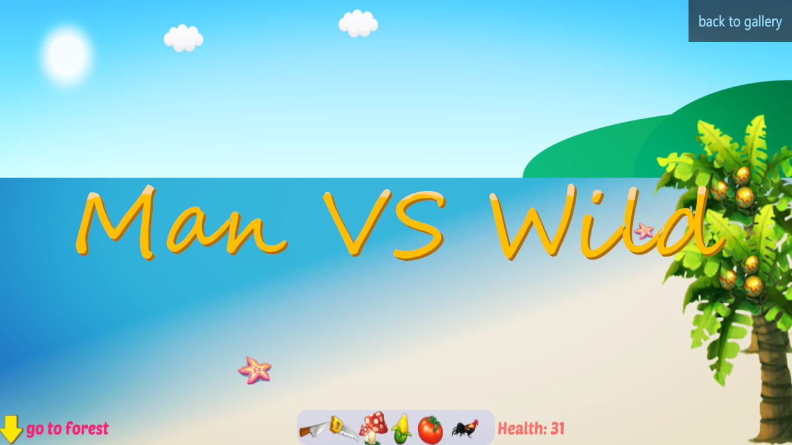
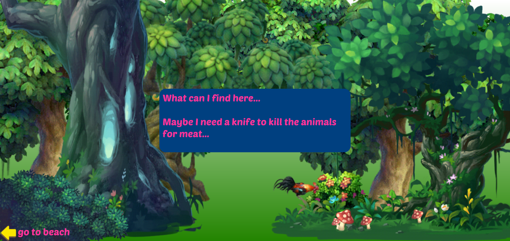
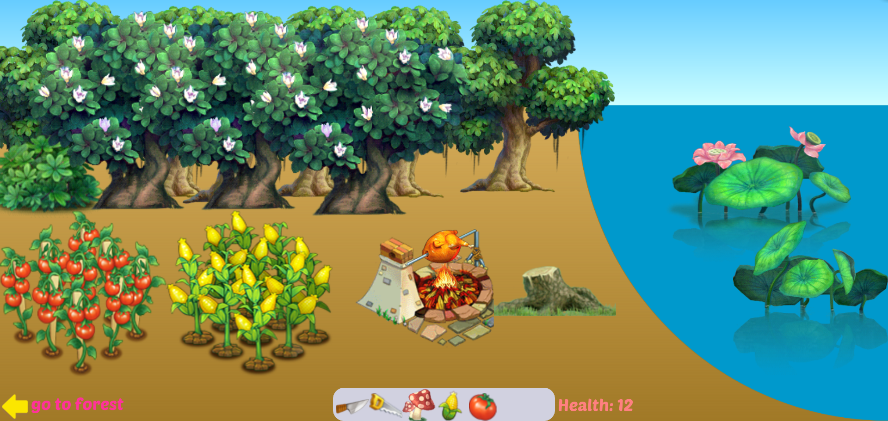

# A Story of Man vs Wild
This is a simple interactive story of Man vs Wild based on p5.js, which is for practicing my JavaScript skills. The story consists of 3 scenes: the beach, the forest and the camp. The viewer will act as a survivor and explore the scenes to seek food for survival.

## Scene1: the beach
This is the beginning of the story. A message box will firstly be shown in the middle of the screen to illustrate the background of the story.  

**Story Background:** The viewer is participating a reality show in which the viewer could win a prize of $1,000,000 if he/she achieves surviving on the island for 1 year.  

In this scene, the survivor can enjoy a beautiful sea view: the blue sea, the glaring sun, some moving clouds, the golden beach, coconut palms, two starfish and some green hills at a distance. The sound of sea waves would comfort the survivor and make the scene more complete. The survivor could click on the coconut palms for several times and a coconut will drop down. However, when interacting with the coconut, a message box will appear in the middle of the screen to tell the survivor that he/she can't crack it because of lacking tools.  

After 1000 `frameCount`, the survivor will be able to explore the next scene.  

## Scene2: the forest
There are a lot of trees and bushes in the screen and the background sound is birds' singing. The survivor will explore the forest by clicking on plants or animals. There are four items the survivor could interact with, 3 red mushrooms and a chicken. The mushrooms can be collected to the bag directly but the chicken can't. Like the coconut, the survivor needs to find some tool to kill the chicken. If the survivor eats the mushroom in the bag, the health points will increase slightly by a random number which is less than 5, and a message box will be shown to tell how it tastes.  

After 1800 `frameCount`, the survivor will be able to explore the third scene.

## Scene3: an abandoned camp
The survivor will discover an abandoned camp where he/she can get some useful tools (to crack coconuts or kill the chicken). The bonfire is interactive which can be used to roast the chicken. In addition, there are two farmlands on the left side which will grow tomatoes and corns. They grow at a very slow speed, but if the survivor works on them by moving the mouse constantly on the lands, the crops will grow faster. The survivor can see different stages that how the crops grow up. After the crops ripe, the survivor can click on the lands to harvest and click on the products in the bag to eat. What's more, one of the lotuses in the lake is interactive which will bloom if being clicked.

## Use p5.js
[p5.js](https://p5js.org/) a JS client-side library for creating graphic and interactive experiences, based on the core principles of Processing.
To run this project, you have to run a [local server](https://github.com/processing/p5.js/wiki/Local-server).
